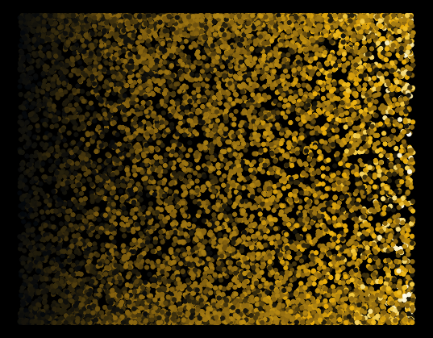
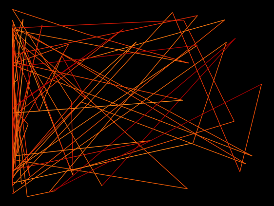
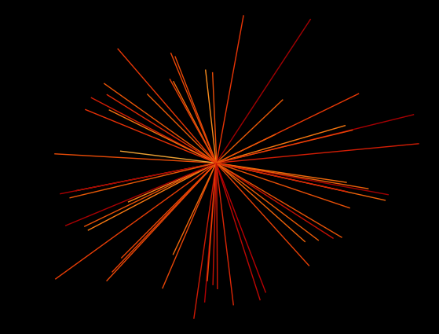

# generativeArt
generative art using trigonometry functions


## blue dots


## green explosion


## gold glitter  x= sin(x)


## y = sin(y)


## fire triangles
```
x= x ^sin(z),
y = sin(y)/x,
col= z
```



## star
```
geom_spoke( aes(angle= sin(x), radius= z), show.legend = F)+
geom_spoke( aes(angle= (x)^z, radius= z*y), show.legend = F)+
```



