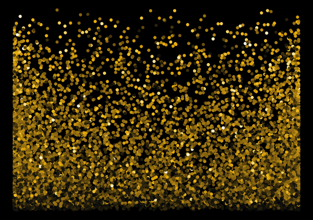

# generativeArt
generative art using trigonometry functions


## blue dots


## green explosion


## gold glitter  x= sin(x)


## y = sin(y)


## fire triangles
```
x= x ^sin(z),
y = sin(y)/x,
col= z
```


